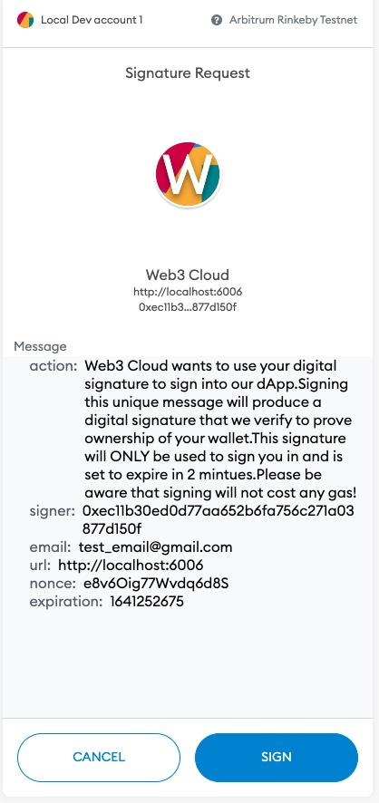

# Web3 Cloud

Web3-Cloud is a Web3 Ethereum-compatible authenticator.

Web3-Cloud is a system designed to create simple secure User Sign-up, Sign In, and access control. Letting a user’s Ethereum wallet become an extension of their digital identity without the need for legacy password ownership models. We want to server as bridge between web2 and web3, allowing developers to leverage blockchain technology while also benefiting from high-speed efficiency and cost reduction of cloud infrastructure.

---

## Signature Verification Types
- EIP712 - MetaMask Sign Typed Data v4. Currently represents the latest version of EIP712 spec. 

### Verication-EIP712
Current Blockchain Network support
1. Rinkeby Test Network
  - contract address: https://rinkeby.etherscan.io/address/0xdC56725aE658b7AE6110507Cec09E506bEEA8410
2. Arbitrum Rinkeby
  - contract address: https://rinkeby-explorer.arbitrum.io/address/0x0ECeF04E2686372e49C27343e1306d6674F782E5
3. Mainnet Ethereum (coming soon)
4. Arbitrum Mainnet (coming soon)

---

## Cloud storage support(User Identity Management)
- (coming soon)
---

## Requirements
- 4.14.0 of MetaMask
---

## Install

```
$ npm install web3-cloud
```

## Usage 
List of components:
1. Connection - Dapp UI Connection component for user interaction with Ethereum wallet
```
// Connection property types (use as a reference)
  Connection.propTypes = {
    primary: PropTypes.bool,
    backgroundcolor: PropTypes.string,
    size: PropTypes.oneOf(['small', 'medium', 'large']),
    verfiyinglabel: PropTypes.string.isRequired,
    passweb3data: PropTypes.func.isRequired,
    errorcallback: PropTypes.func.isRequired,
    verificationtype: PropTypes.oneOf(['EIP712']),
    dappname: PropTypes.string.isRequired,
    logourl: PropTypes.string,
    dappid: PropTypes.string,
  };
```
Structure of data returned from Connection component (passweb3data callback)
| Data | Data Type | Description
| --- | --- | --- |
| actionType | string | Type of authentication (SIGN_UP, SIGN_IN, SIGN_OUT, CHANGE_ACCOUNT, CHANGE_NETWORK) 
| verificationType | string | Signature type (EIP712)
| networkName | string | Name of connected network
| networkScanner | string | Block scanner URL for connected network
| email | string | Account email address
| provider | string | Wallet provider (Metamask)
| firstName | string | Account first name
| lastName | string | Account last name
| signature | object | Object that contains signature data
```
// example web3 data
{
  actionType: "SIGN_UP"
  email: "test_email@gmail.com"
  firstName: "Idris"
  lastName: "Bowman"
  networkName: "Arbitrum Rinkeby"
  networkScanner: "https://rinkeby-explorer.arbitrum.io/address"
  provider: "metamask",
  verificationType: "EIP712",
  signature: {
    account: "0x91D64b9ceA4D580B857D77e25fECe02d5F5150cc"
    chainId: 421611
    ens: "web3.eth"
    expiration: 1641251976
    isSigned: true
    isVerified: true
    message: "Web3 Cloud wants to use your digital signature to sign into our dApp. Signing this unique message will produce a digital signature that we verify to prove ownership of your wallet. This signature will ONLY be used to sign you in and is set to expire in 2 minutes. Please be aware that signing will not cost any gas!"
    nonce: "wbYho2YSKudoZnv3F"
    r: "0x8f0f8b39bae996305fe351b8b71ecb8950378bc83d28053ca4bed07fdf722680"
    s: "0x61512a003d41fa094e13981f7f471c037237c465dd9991f8f403b2b4d678897b"
    sigType: "EIP712"
    url: "http://localhost:6006"
    v: 27
  }
}
```

Structure of data returned from Connection component (errorcallback callback)
| Data | Data Type | Description
| --- | --- | --- |
| actionType | string | Type of authentication (SIGN_UP, SIGN_IN) 
| verificationType | string | Signature type (EIP712)
| message | string | Error message
```
// example error data
{
  actionType: "SIGN_UP"
  message: "Sign in/ Sign up not supported for current network. Try changing networks"
  verificationType: "EIP712"
}
```

### Connection Component (EIP712 Verifcation Type)
1. Add imports for web3-cloud and useCallback (react hooks)
 ```
 import { Connection } from "web3-cloud";
 import { useCallback } from "react";
```

2. Add component(Example implementation using React)
```
// Define ReactHooks Callbacks
    const web3DataCallback = useCallback((web3Values) => {
    // pass web3 Data to your applications Redux store
     try {
        switch(web3Values.actionType) {
          case 'SIGN_UP':
            // create user in database
            break;
          case 'SIGN_IN':
            // fetch user data from database
            break;
        }
      } catch(err) {
        // handle errors
      }
  }, []);

  const web3ErrorCallback = useCallback((error) => {
    // handle errors based on error types
    try {
      switch(web3Values.actionType) {
        case 'SIGN_UP':
          // create user in database
          break;
        case 'SIGN_IN':
          // fetch user data from database
          break;
      }
      } catch(err) {
        // handle errors
      }
  }, []);

  <Connection
    primary={true}
    backgroundcolor='blue'
    size='large'
    verfiyinglabel='Verfiying Signature...'
    verificationtype='EIP712'
    dappname='Web3 Cloud'
    dappid='my-dapp'
    logourl='https://idrisbowman.com/images/idrisBowmanIcon.jpg'
    passweb3data={web3DataCallback}
    errorcallback={web3ErrorCallback}
  />
```


---

---

---

---

## Local dev
1. Install Dependencies
```
$ npm install
```

2. Run Storybook
```
$ npm run storybook
```

## Local testing
1. Run Unit test with coverage
```
$ npm run test:coverage
```

2. Run Unit test without coverage
```
$ npm run test:coverage
```

3. Clear jest
```
$ npm run clear:jest
```

## Authors
*  [Idris Bowman](https://www.linkedin.com/in/idris-bowman)
