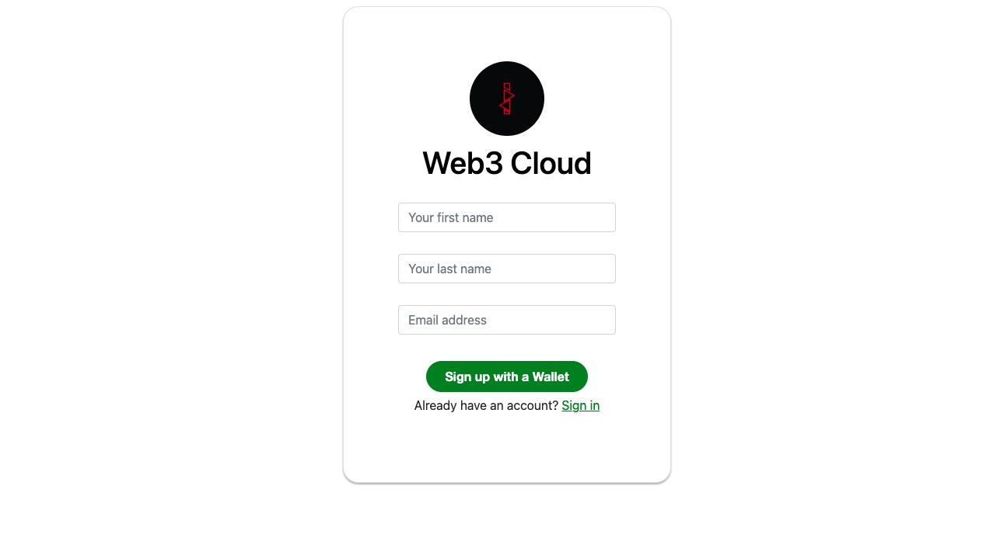
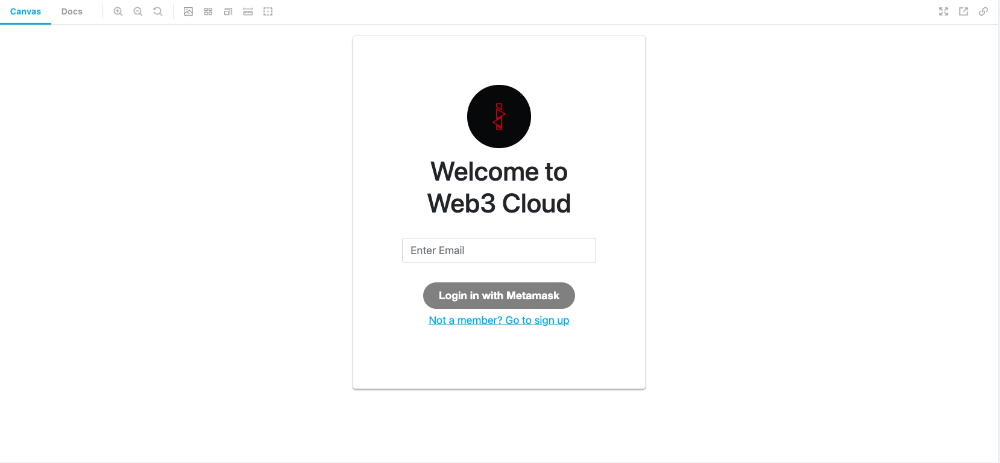
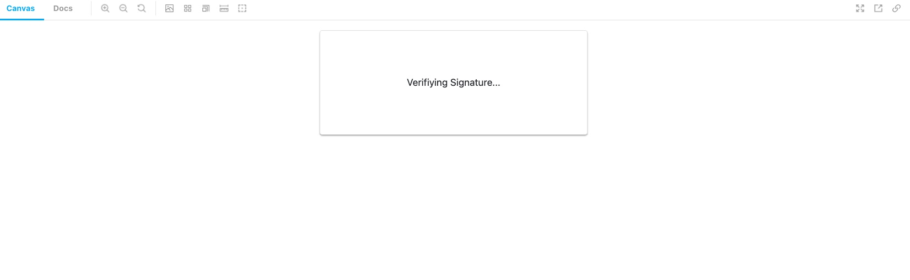

# Web3 Cloud

Simple Sign-up, Sign In Ethereum account authenticator. Power by Sign-In with Ethereum.

Web3-Cloud is a React component library designed to create simple secure User Sign-up, Sign In. Generate [EIP-1271 signatures](https://eips.ethereum.org/EIPS/eip-1271)

## Coming soon(Join waiting list)
[Secure Auth3](https://www.secureauth3.com/)
The perfect solution for Developers who want integrate Web3 sign-in/sign-up into their applications. Auth3 API was built to provide a new web3 authentication model that give users more control over their digital identity without the need for legacy password ownership models.

---

## Quick start application
- repo: https://github.com/V00D00-child/web3-cloud-quick-start
- view live: https://www.findmynft.org/

## Device support
(Desktop, tablet, Mobile)

## Requirements
- 4.14.0 of MetaMask
- Infura Project Id (https://infura.io/)
- @walletconnect/web3-provider - 1.7.1 (https://www.npmjs.com/package/@walletconnect/web3-provider)
- react - 17.0.2 (https://www.npmjs.com/package/react)
- react-dom - 17.0.2 (https://www.npmjs.com/package/react-dom)
---

## Install

```
$ npm install web3-cloud
```

## List of components  
- Connection component
- Single Sign on button component (coming soon)
- Web3 Authentication provider component (coming soon)
### Connection component 
- Description: Dapp UI Connection component for Ethereum wallet sign in/sign up
- Features:
  1. Sign in/Sign up: Responsive Form with validation (email, first name, last name)
  2. ENS Resolution
  3. (Optional)Fetch nonce from backend server(Sign-In with Ethereum)
      - Follow recommended documention for fetching nonce from a backend server (https://docs.login.xyz/sign-in-with-ethereum/quickstart-guide/implement-the-backend)
  4. (EIP-1271 signatures) Sign-In with Ethereum - https://github.com/spruceid/siwe
  5. Sign message with nonces
  6. Signature expiration time: 10 mins

```typescript
// Connection component prop types 
interface ConnectionProps {
  primary: boolean;
  backgroundcolor: string; 
  size: string; 
  verifyinglabel: string;
  passweb3data: (web3Data: ActionData) => void;
  errorcallback: (errorData: ErrorMessageData) => void;
  dappname: string;
  logourl: string;
  infuraId: string;
  homePageurl: string;
  disableErrorDisplay: boolean;
  messageToSign: string;
  backend?: Backend
}

interface Backend {
  endpoint: string,
  requestOptions: {
      method: string,
      headers?: any
  }
}
```

Structure of data returned from Connection component (passweb3data: ActionData)
| Data | Data Type | Description
| --- | --- | --- |
| email | string | Account email address
| address | string | Ethereum account
| ens | string | Register ENS for Ethereum account
| firstName | string | Account first name
| lastName | string | Account last name
| actionType | string | Type of authentication (SIGN_UP, SIGN_IN) 
| networkName | string | Name of connected network
| networkScanner | string | Block scanner URL for connected network
| signature | string | String that contains signature data
| message | string | String that contains message that account signed
| provideType | string | name of Wallet provider (metamask, wallet-connect)
| nonceSetFromBackend | boolean | set to true when nonce in message comes from backend endpoint
| web3Provider | ethers.providers.Web3Provider | Web3 Provider

```javascript
// example web3 data
{
  actionType: "SIGN_IN"
  address: "0x6C18230EF8Bf455adDA98F5E3ABfe710bD8489C2"
  chainId: 1
  email: "test_email@gmail.com"
  ens: ""
  networkName: "Mainnet Ethereum"
  networkScanner: "https://etherscan.io/address"
  provider: "metamask"
  verificationType: "SIWE"
  signature: "fjsjbj2j2bj33333ff33ffdff43"
  message: "<message that was signed>"
  nonceSetFromBackend: true
  web3Provider: {connection: {url: 'metamask'}...}
}
```

Structure of data returned from Connection component (errorcallback callback)
| Data | Data Type | Description
| --- | --- | --- |
| actionType | string | Type of authentication (SIGN_UP, SIGN_IN) 
| verificationType | string | Signature type (EIP712)
| message | string | Error message

```typescript
// example error data
{
  actionType: "SIGN_UP"
  message: "Sign in/ Sign up not supported for current network. Try changing networks"
  verificationType: "SIWE"
}
```

### Usage
1. Add imports for web3-cloud and useCallback (react hooks)
 ```typescript
 import { Connection } from "web3-cloud";
 import { useCallback } from "react";
```

2. Add component(Example implementation using React)
```typescript
// Define ReactHooks Callbacks
    const web3DataCallback = useCallback((web3Values) => {
     try {
        switch(web3Values.actionType) {
          case 'SIGN_UP':
            // create user in database
            // pass web3 Data to your applications Redux store
            break;
          case 'SIGN_IN':
            // fetch user data from database
            break;
        }
      } catch(err) {
        // handle errors
      }
  }, []);

  const web3ErrorCallback = useCallback((error) => {
    // handle errors based on error types
    try {
      switch(web3Values.actionType) {
        case 'SIGN_UP':
          break;
        case 'SIGN_IN':
          break;
      }
      } catch(err) {
      }
  }, []);


// Option 1 - With nonce backend
  <Connection
    primary={true}
    backgroundcolor='green'
    size='large'
    verifyinglabel='Verifiying Signature...'
    dappname='Web3 Cloud'
    infuraId='<your infura id>'
    logourl='<your dapp logo image url>'
    homePageurl='<your dapp home page url>'
    disableErrorDisplay={false}
    messageToSign={'Your message that users will sign'}
    backend={{
        endpoint: 'https://my.api.com/nonce',
        requestOptions: {
          method: 'GET',
          headers: {
            'Authorization': `Bearer ${apiKey}`
          }
        }
      }}
    passweb3data={web3DataCallback}
    errorcallback={web3ErrorCallback}
  />

  // Option 2 - Without nonce backend 
  <Connection
    primary={true}
    backgroundcolor='green'
    size='large'
    verifyinglabel='Verifiying Signature...'
    dappname='Web3 Cloud'
    infuraId='<your infura id>'
    logourl='<your dapp logo image url>'
    homePageurl='<your dapp home page url>'
    disableErrorDisplay={false}
    messageToSign={'Your message that users will sign'}
    passweb3data={web3DataCallback}
    errorcallback={web3ErrorCallback}
  />
```



---


---


---


---

## Local dev
1. Install Dependencies
```
$ npm install
```

2. Run Storybook
```
$ npm run storybook
```

## Local testing
1. Run Unit test with coverage
```
$ npm run test:coverage
```

2. Run Unit test without coverage
```
$ npm run test:coverage
```

3. Clear jest
```
$ npm run clear:jest
```

## Authors
*  [Idris Bowman](https://www.linkedin.com/in/idris-bowman)
