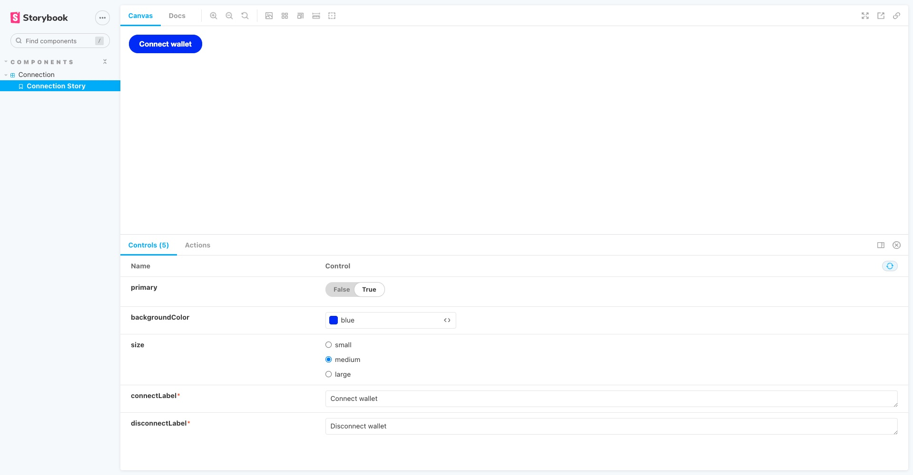
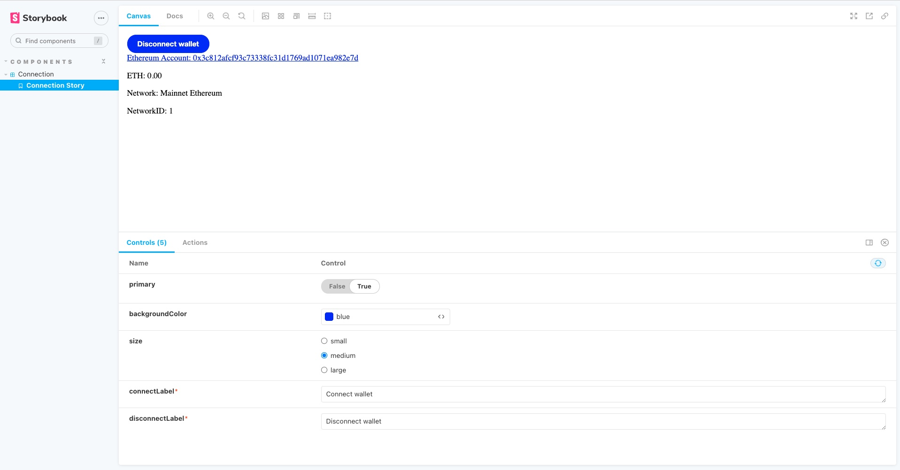

# Web3 Cloud

Web3 Cloud is web3 Ethereum-compatible authenticator

This is Web3 Cloud an Web3 React library for user wallet authentication. It acts as bridge between web2 and web3, which allows developers to combine the security of blockchain technology with scalable cloud technology.

---

## Ethereum network support
- Kovan(coming soon)

## Cloud storage support
- AWS DynamoDB(coming soon)
---
## Install

```
$ npm i web3-cloud
```

## Usage 
List of components:
1. Connection
### Connection(component)
Dapp UI Connection component for user interaction with Ethereum wallet

1. Add imports for web3-cloud and useCallback(react hooks)
 ```
 import { Connection } from "web3-cloud";
 import { useCallback } from "react";
```
2. Add commponent
```
// Connection property types (use as a reference)
  Connection.propTypes = {
    primary: PropTypes.bool,
    backgroundColor: PropTypes.string,
    size: PropTypes.oneOf(['small', 'medium', 'large']),
    connectLabel: PropTypes.string.isRequired,
    disconnectLabel: PropTypes.string.isRequired,
    parentWeb3Callback: PropTypes.func.isRequired,
  };
```

Structure of data returned from Connection component
| Data | Data Type | Description
| --- | --- | --- |
| isConnected | boolean | Value to determine if user has connected wallet 
| connection | window.ethereum | Web3 provider
| account | string | Ethereum public address
| network | string | Name of connected network
| networkId | string | Connected network chain ID
| networkScanner | string | Block scanner url for connected network
| ethBalance | string | Current ETH blance of connnected account

- Example implementation using React
```
// ReactHooks Callback
  const callback = useCallback((web3Values) => {
    console.log(web3Values);
  }, []);

  <Connection
      backgroundColor="blue"
      size="medium"
      connectLabel="Connect wallet"
      disconnectLabel="Disconnect wallet"
      primary={true}
      parentWeb3Callback={callback}
  />
```


---


## Authors

*  [Idris Bowman](https://www.linkedin.com/in/idris-bowman)
